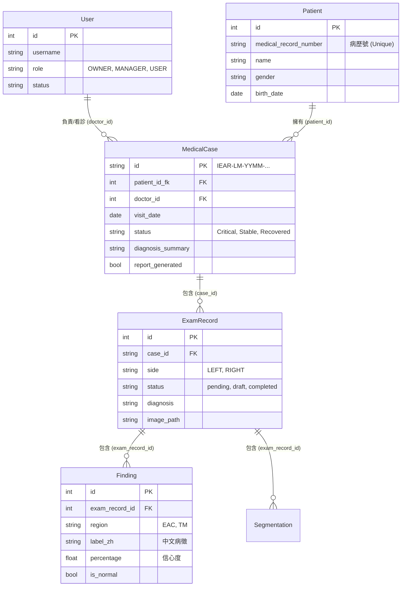

# 資料庫架構說明 (SQL Schema Documentation)

本文件詳細說明 IEAR-LM 系統的資料庫設計，包括各個資料表的用途、欄位定義以及表格之間的關聯性。

## 1. 實體關聯圖 (ER Diagram)

以下是系統核心資料表的關聯圖：

## 2. 資料表詳細說明

### 2.1 Users (系統使用者)
儲存醫生、護理師或管理員的帳號資訊。

| 欄位名稱 | 類型 | 說明 |
| :--- | :--- | :--- |
| `id` | Integer (PK) | 使用者唯一識別碼 |
| `username` | String | 登入帳號 (Unique) |
| `role` | Enum | 角色權限：`OWNER` (擁有者), `MANAGER` (管理者), `USER` (一般用戶) |
| `status` | Enum | 帳號狀態：`active`, `suspended`, `invited` |
| `department` | String | 所屬科別 |

### 2.2 Patients (病患資料)
儲存病人的核心身份資訊。此表僅儲存「人」的屬性，不包含病歷資料。

| 欄位名稱 | 類型 | 說明 |
| :--- | :--- | :--- |
| `id` | Integer (PK) | 內部流水號 |
| `medical_record_number` | String | **病歷號 (MRN)**，醫院或診所的病患編號 (Unique) |
| `name` | String | 病患姓名 |
| `gender` | String | 性別 |
| `birth_date` | Date | 出生日期 |

### 2.3 MedicalCases (就診紀錄/病例)
代表病人的一次「看診」或「入院」紀錄。這是病歷管理的核心單元。

| 欄位名稱 | 類型 | 說明 |
| :--- | :--- | :--- |
| `id` | String (PK) | 自定義病例編號 (如 `IEAR-LM-2601-001`) |
| `patient_id_fk` | Integer (FK) | 關聯到 `Patients.id` |
| `doctor_id` | Integer (FK) | 關聯到 `Users.id` (主治醫師) |
| `visit_date` | Date | 就診日期 |
| `status` | Enum | 病情狀態：`Critical` (危急), `Stable` (穩定), `Recovered` (康復) |
| `diagnosis_summary` | String | 綜合診斷摘要 (例如 "左耳中耳炎") |
| `report_generated` | Boolean | 是否已生成 Word/PDF 報告 |

### 2.4 ExamRecords (檢查紀錄)
儲存單側耳朵 (左耳或右耳) 的檢查詳情。一次就診 (`MedicalCase`) 通常包含兩個 `ExamRecord` (左、右各一)。

| 欄位名稱 | 類型 | 說明 |
| :--- | :--- | :--- |
| `id` | Integer (PK) | 檢查紀錄流水號 |
| `case_id` | String (FK) | 關聯到 `MedicalCases.id` |
| `side` | Enum | 部位：`LEFT` (左耳), `RIGHT` (右耳) |
| `status` | Enum | 檢查狀態：`pending`, `draft`, `completed` |
| `image_path` | String | 原始內視鏡影像的路徑/URL |
| `diagnosis` | String | 該側耳朵的具體診斷 |

### 2.5 Findings (病理發現)
儲存 AI 模型檢測到或醫生標註的具體病徵細項。

| 欄位名稱 | 類型 | 說明 |
| :--- | :--- | :--- |
| `id` | Integer (PK) | 流水號 |
| `exam_record_id` | Integer (FK) | 關聯到 `ExamRecords.id` |
| `region` | Enum | 解剖位置：`EAC` (外耳道) 或 `TM` (耳膜) |
| `label_zh` | String | 病徵名稱 (中文)，如 "耳垢栓塞" |
| `label_en` | String | 病徵名稱 (英文)，如 "Impacted cerumen" |
| `percentage` | Float | AI 信心分數或嚴重程度 (0.0 - 100.0) |
| `is_normal` | Boolean | 是否屬於正常特徵 |

### 2.6 Segmentations (影像分割)
儲存 AI 分割出的病灶區域座標，用於在前端影像上繪製標記。

| 欄位名稱 | 類型 | 說明 |
| :--- | :--- | :--- |
| `id` | Integer (PK) | 流水號 |
| `exam_record_id` | Integer (FK) | 關聯到 `ExamRecords.id` |
| `label` | String | 分割區域標籤 |
| `path` | String | SVG Path 字串或多邊形座標點集合 |
| `color` | String | 顯示顏色 (Hex Code) |

## 3. 資料操作流程 (Data Flow)

1.  **新增病患**：前端呼叫 `POST /api/v1/patients` -> 寫入 `Patients` 表。
2.  **建立病例**：前端呼叫 `POST /api/v1/cases` -> 寫入 `MedicalCases` 表。
3.  **儲存診斷**：
    *   前端使用者在介面上確認 AI 分辨結果。
    *   前端呼叫 `POST /api/v1/cases/{id}/diagnosis`。
    *   後端接收資料：
        1.  更新 `MedicalCases` 的診斷摘要與狀態。
        2.  **刪除** 該 Case 下舊的 `ExamRecords` (Cascade 刪除舊 Findings)。
        3.  **新增** 新的 `ExamRecords` 與 `Findings`，確保資料庫與前端編輯結果完全一致。

## 4. 關聯刪除 (Cascading Delete)

系統設定了「關聯刪除」規則，以維護資料完整性：
*   刪除 `MedicalCase` 會自動刪除其下所有的 `ExamRecords`。
*   刪除 `ExamRecord` 會自動刪除其下所有的 `Findings` 和 `Segmentations`。
*   (注意) 刪除 `Patient` 會自動刪除該病患所有的 `MedicalCases`。
